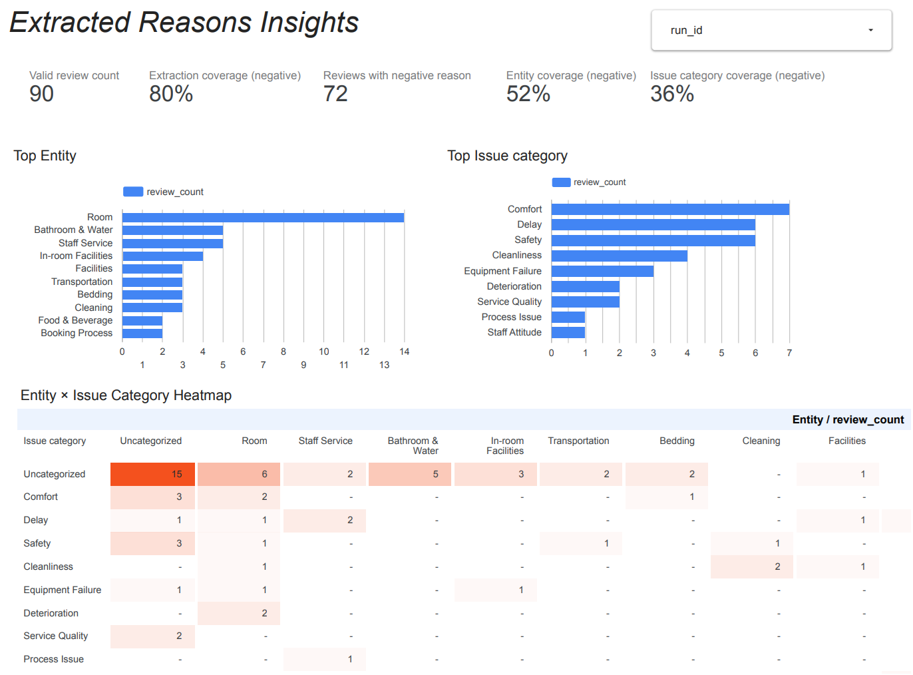
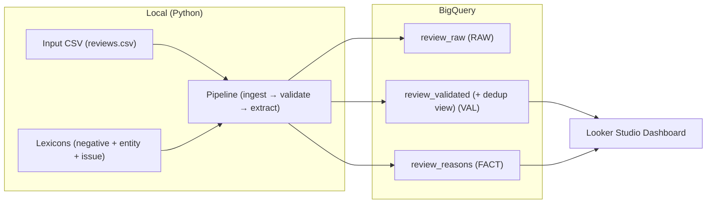
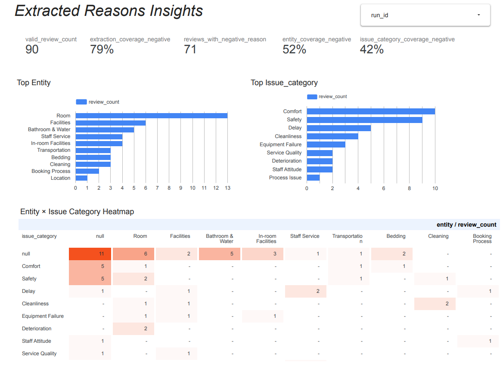

# Review Insight Data Pipeline

A lightweight DataOps-style pipeline for extracting negative review reasons using rule-based NLP, storing results in BigQuery, and visualizing KPIs in Looker Studio.

## Overview
This project:

1. Loads negative reviews (e.g., hotel reviews) from CSV  
2. Extracts negative reasons (subject–predicate pairs) using rule-based NLP in Python  
3. Stores the processed results in BigQuery  
4. Visualizes KPIs and negative reasons in Looker Studio  

<br/>

**Note:** Reviews are currently in Japanese (MeCab + Japanese lexicons/rules).
The pipeline architecture (ingest → validate → extract → load → BI) is not tied to a specific language, and the NLP extraction module is designed to be swappable per language (e.g., spaCy-based tokenization + lexicon for English/German).

<br/>

## Demo / Output



- [Output PDF](docs/Report_on_Negative_Review_Reasons.pdf)
- [Looker Studio dashboard](https://lookerstudio.google.com/reporting/a6186eaf-dfec-409e-91ba-79826297d478)


## Architecture
CSV → Python (cleaning + rule-based extraction + validation) → BigQuery → Looker Studio

- Ingestion inputs: a local CSV file and lexicons used to detect negative terms and categorize extracted reasons.
- Processing: Python scripts
- Storage: 3 tables + 1 view ([see Data Model section](#data-model))
- BI: Looker Studio (top reasons, trends, data quality metrics)



Note: Negative lexicon credit: Japanese Sentiment Dictionary (Volume of Nouns) ver. 1.0, developed by the Inui–Okazaki Laboratory, Tohoku University.


## Dataset
- Default source in this repo: Synthetic (dummy) reviews for a hotel (data/input/sample_thotel_reviews.csv)
  - The pipeline works with real-world reviews as well, as long as they follow the same CSV schema.

- Language: Japanese (current rules are optimized for Japanese text)
### Expected CSV schema
Columns expected in the input CSV:

- source_id (Review ID in the original source. Type: STRING or INT64)(REQUIRED)
- source (Review source name. Type: STRING; e.g., booking.com, tripadvisor)(REQUIRED)
- review_text (Review text to analyze. Type: STRING)(REQUIRED)
- posted_at (When the review was posted. Type: DATE or TIMESTAMP)(REQUIRED)
- user_name (Reviewer name. Type: STRING) (OPTIONAL)


## Data Model

This pipeline follows a layered data architecture:

1. **review_raw**  
   - Ingested raw data from source  
   - No transformation applied  

2. **review_validated**  
   - Transformed and schema-validated data  
   - May contain duplicate `review_id` records  
   (`review_id` is a deterministic UUID v5 generated from the combination of
  (`source`, `source_id`), ensuring consistent cross-run identification.)

3. **review_validated_dedup (View)**  
   - Deduplicated view of `review_validated`  
   - Keeps only the latest record per `review_id`  
   - Uses `ingested_at` to select the most recent entry  

4. **review_reasons**  
   - Extracted reasons

<br/>

Note: Table names are generated dynamically using a configurable prefix
and can be modified via `config/settings.py`.

[Tables Detail](docs/data_dictionary.md)

[ER Diagram](docs/er_diagram.md)


## Data Quality Checks
Implemented minimal checks for raw reveiws before loading to BigQuery:
- required column presence(`source_id`, `source`, `review_text`, and `posted_at`).
- duplicate `reviews` detection: check whether `source_id` and `source` are the same. if so, we consider them to be the duplicated reviews.
- invalid timestamp format handling(`posted_at` and `posted_at_iso`. (`posted_at_iso` will be added as metadata for loading into BigQuery after ingestion.))
- basic length filter to `review_text` (between 5 and 500 characters).

<br/>

Note: Records that do not pass the quality check are flagged as `is_valid = False` and excluded from downstream processing. They can be monitored in the review_validated table.
<br/>

###  (In progress) dbt migration
I am currently migrating part of the pipeline to dbt to make the quality checks (and the data transformations) more reproducible.

So far, I have:

- Added a data quality test to check that review_id is unique (no duplicates)

Next steps:


- Add more tests (e.g., not null, accepted values, timestamp format checks)
- Move more validation/transformation logic into dbt models

## Extraction Logic (Rule-based)
Goal: extract word-pairs like **(subject, predicate)** from a negative review.

Current rule examples: First, we detect negative terms in each review using the negative lexicon, then extract the paired subject and/or predicate from the same sentence using the rules below:
- When the negative term is a noun: Extract the verb, adjective, or adjectival noun immediately following it within the same sentence as the predicate.
- When the negative term is a verb/adjective/adjectival noun: Extract the noun closest to the negative word appearing earlier in the same sentence as the subject.

[Other rules are here](docs/extraction_rules.md)

<br/>

Output fields:
- `reason_subject` (e.g., “ベッド(Bed)”, “スタッフ(Staff)”, “風呂(Bathroom)”. The subject can be multiple terms)
- `reason_predicate` (e.g., “汚い(dirty)”, “うるさい(noisy)”, “不愛想(unfriendly)”)


Limitations:
- Cannot extract(detect) reasons from 'contextually negative texts' that don’t contain any negative words. (e.g., "隣の部屋から音が聞こえました"("I heard people talking in the next room."))
- Multiple reason pairs can be extracted from one review, but they may not represent different problems: they might describe the same issue using different wording (e.g., S1: Linen / P1: Dirty , S2: Towel / P2: Unpleasant).
- The extracted subject may include multiple tokens and some unnecessary words, since it is difficult to isolate a single subject with the current word-level logic. (e.g., S:['東京'(Tokyo),'ホテル'(hotel),'リネン'(linen)], P:'汚い(dirty)'). To imporove this, we may need deeper analysis as semantic parsing.


## Categorizing logic
Goal: categorize the extracted reasons into **Entity** and **Issue** using the customizable lexicons. 

**Entity:** subject(s) are expected to be matched to one entity which defined in entity_lexicon.csv
e.g., 'リネン'(linen) → Bedding. '自販機'(vending machine) → Facilities

| term   | language | entity     | version |
|--------|----------|------------|---------|
| リネン | ja       | Bedding    | 1       |
| 自販機 | ja       | Facilities | 1       |
| ・・・ | 
Excerpt: entity_lexicon.csv


**Issue:** predicate is expected to be matched to one issue-category which defined in issue_lexicon.csv
e.g., '聞こえる(hear)'→'Noise', '不安(worried)'→'Safety'
| term   | language | issue_category | sentiment | version |
|--------|----------|------------|-----|---------|
| 聞こえる | ja       | Noise    | negative | 1       |
| 不安 | ja       | Safety | negative | 1       |
| ・・・ | 
Excerpt: issue_lexicon.csv

Note: The 'sentiment' column could be set to 'positive' when extracting positive reasons instead of negative ones (currently not implemented).


## Dashboard (Looker Studio)
- Sample pdf Report (dummy reviews for a hotel) is available here: `docs/Report_on_Negative_Review_Reasons.pdf`.
- [Dashboard link](https://lookerstudio.google.com/reporting/a6186eaf-dfec-409e-91ba-79826297d478)


### Page 1: Data Quality / Pipeline Health
Shows ingestion volume, deduplication impact (total vs unique), valid/invalid rates, and breakdowns for duplicate groups and invalid reasons.


### Page 2: Extracted Reasons Insights
Shows top entities & issue categories, and the entity × issue_category heatmap based on the canonical (top-confidence) reason per review.

### Page 3: Drilldown / Record Explorer
Allows filtering by run and drilling down to validated records and extracted reasons for auditing/debugging.


## Repo Structure
```text
.
├── README.md
├── config
│   ├── __init__.py
│   └── settings.py    # Non-sensitive application settings and constants
├── credentials
├── data
│   ├── input          # place the file here you'd like to analyze
│   │   └── sample_hotel_reviews.csv
│   └── output         # Used for debugging and local development.  
|                      # Outputs a CSV file when the run parameter is set to "--output local".
├── dics
│   ├── entity_lexicon.csv    # for categorizing entity
│   ├── issue_lexicon.csv     # for categorizing issue
│   └── sentiment_lexicon.csv # for detecting a polarity term
├── docs
│   ├── data_dictionary.md
│   ├── er_diagram.md
│   ├── extraction_rules.md
|   └── Report_on_Negative_Review_Reasons.pdf # sample report for hotel reviews (used only dummy data)
├── requirements.txt
├── sql
│   ├── 10_views_dq.sql      # sql for creating DQ views
│   └── 11_views_kpi_reasons.sql  # sql for creating KPI Reason views
├── src
│   ├── __init__.py
│   └── reason_extraction
│       ├── __init__.py
│       ├── main.py          # Entry point for the extraction pipeline
│       ├── apply_sql.py     # Creates BigQuery views for Looker Studio
│       ├── extraction       # Review reason extraction logic
│       ├── ingestion        # Data ingestion module
│       ├── output           # BigQuery loading module
│       ├── pipeline         # Pipeline orchestration
│       ├── preprocessing    # Data preprocessing
│       ├── transformation   # Data transformation
│       └── validation       # Data quality validation
├── tests
```

<br/>

## Setup

### Quick Start (Recommended)

Run the pipeline locally in a Docker container with the command below. No GCP setup is required.

```bash
make
```


### Alternative Setup (CLI / Native Environment)
If you prefer to run the project without Docker, or want to use BigQuery output, follow the steps below to set up a local environment.


### Requirements
- Python 3.12 or later

- A Google Cloud project with a BigQuery dataset configured

### Prerequisites (Ubuntu / WSL2)
This project uses MeCab via mecab-python3.
Install the required system dependencies first:

``` bash
sudo apt-get update
sudo apt-get install -y mecab libmecab-dev mecab-ipadic-utf8
```


#### Sanity check

Verify that MeCab is installed correctly:

``` bash
echo "こんにちは" | mecab
``` 

If installation is successful, the command should output the parsed result.


### Install Python dependencies
Create a virtual environment and install the required packages:

``` bash
python -m venv .venv
source .venv/bin/activate
pip install --upgrade pip
pip install -r requirements.txt
```


### Environment Variables
Copy .env.example to .env, then configure the following variables:

`UUID_STRING` – Used to generate a consistent reason_id for identical review texts across different pipeline runs.
Generate one by running:

``` bash
uuidgen
```

`PROJECT_ID` – Your BigQuery project ID.

`DATASET_ID` – Your BigQuery dataset ID.

`TABLE_PREFIX` - Prefix for the output tables.

`GOOGLE_APPLICATION_CREDENTIALS` – Path to your Google Cloud service account key JSON file (set either in your system environment or in .env).


⚠️ Do not commit your service account key file to the repository.


### Run

Place the file you want to analyze in `data/input/`, then run the command below.

(For the required file schema, see [here](#expected-csv-schema)).
```
python -m src.reason_extraction.main \
  --input-file data/input/(your filename).csv  \
  --output bigquery
```

To output the analysis results to `data/output/` instead of BigQuery, run:
```
python -m src.reason_extraction.main \
  --input-file data/input/(your filename).csv  \
  --output local
```

### How to create BigQuery Views
After running main.py, run the command below:
```
python -m src.reason_extraction.apply_sql
```

<br/>

## CI/CD (GitHub Actions)
This repository includes a lightweight CI/CD workflow using GitHub Actions.

### Triggers

Manual run (workflow_dispatch), and
Scheduled run (daily cron).

### Steps
- Runs unit tests (pytest) first.
The pipeline executes only if tests pass
Pipeline execution.

- Loads results into BigQuery (demo mode uses `WRITE_MODE=TRUNCATE` to avoid accumulating data in the sandbox)

### Authentication

Uses a GCP service account via GitHub Secrets.

Note: For production, prefer Workload Identity Federation (OIDC) instead of long-lived service account keys.

<br/>

## MeCab dictionary in this project
For Japanese text processing, this project uses MeCab.

### Local development
I use mecab-ipadic-neologd during development to explore tokenization improvements.

### CI and Docker environment
The workflow uses the default ipadic dictionary to keep the pipeline lightweight and reproducible.

### Ongoing evaluation (ipadic vs. neologd)
I’m currently evaluating which dictionary performs better for this task. In a small benchmark on the sample dataset, both dictionaries achieved similar overall extraction coverage, while neologd slightly improved issue-category coverage (+6pp in this dataset). Next, I plan to compare them using a small manually labeled set and report precision/recall, to avoid optimizing for coverage only.

#### Dashboard snapshot (neologd)
Below is a snapshot of the “Extracted Reasons Insights” dashboard generated using `mecab-ipadic-neologd` on the sample dataset.

