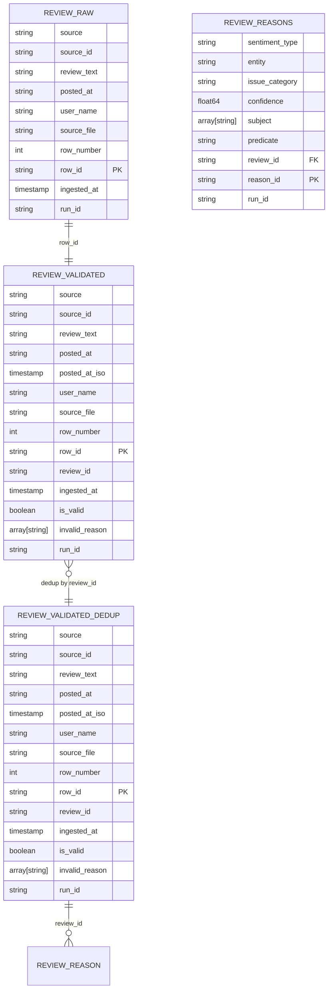

### Entity Relationship Diagram

```mermaid
erDiagram
  REVIEW_RAW {
    string   source
    string   source_id
    string   review_text
    string   posted_at
    string   user_name
    string   source_file
    int      row_number
    string   row_id PK
    timestamp ingested_at
    string   run_id
  }

  REVIEW_VALIDATED {
    string   source
    string   source_id
    string   review_text
    string   posted_at
    timestamp   posted_at_iso
    string   user_name
    string   source_file
    int      row_number
    string   row_id PK
    string   review_id
    timestamp ingested_at
    boolean  is_valid
    array[string]  invalid_reason
    string   run_id
  }

  REVIEW_VALIDATED_DEDUP {
    string   source
    string   source_id
    string   review_text
    string   posted_at
    timestamp   posted_at_iso
    string   user_name
    string   source_file
    int      row_number
    string   row_id PK
    string   review_id
    timestamp ingested_at
    boolean  is_valid
    array[string]   invalid_reason
    string   run_id
  }

  REVIEW_REASONS {
    string  sentiment_type
    string  entity
    string  issue_category
    float64   confidence
    array[string]  subject
    string  predicate
    string  review_id FK
    string  reason_id PK
    string  run_id
  }

  REVIEW_RAW ||--|| REVIEW_VALIDATED : "row_id"
  REVIEW_VALIDATED }o--|| REVIEW_VALIDATED_DEDUP : "dedup by review_id"
  REVIEW_VALIDATED_DEDUP ||--o{ REVIEW_REASON : "review_id"
```